# Let's learn Web Scrapping

This repository will explaing how to use scrapping technique to extract data from a web page.

## Languages used
Python <code></code>: This will be the main language. We'll use the selenium module to open a chrome-controller instance.</br>
HTML <code></code>: Basic knowledge to scrapping throught the page.</br>
CSS <code></code>: Basic knowledge to identify classes

## Setup pre requirements
<p>For this exercise we will need to download the chromedriver of the related version of our Chrome explorer.</p>
<p>So, let's do this!</p>

### Checking our Chrome version
1. Open Chrome then click the 3dot menu to go to the *Help* option and click on *About Google Chrome*</br>
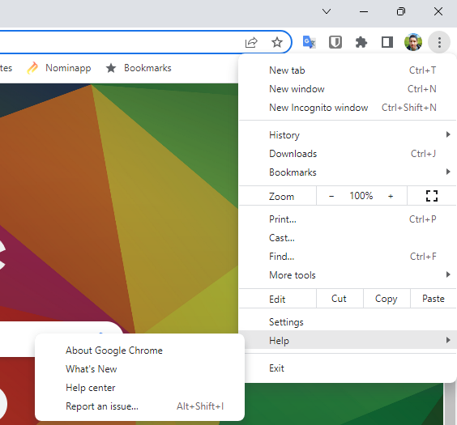

2. Then check the installed version of Chrome, please pay attention to the first three digits, you'll need them. *In the example is showing the version number 109.*</br>
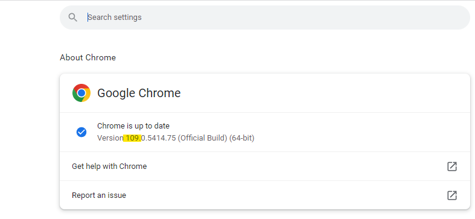

### Downloading Chrome driver
Selenium uses a driver to navigate though the web page, so we'll need to download the driver related to the version of Chrome we've installed.

1. Let´s google *chromedriver* to go to the <a href="https://chromedriver.chromium.org/">**Chromium.org**</a> page.</br>
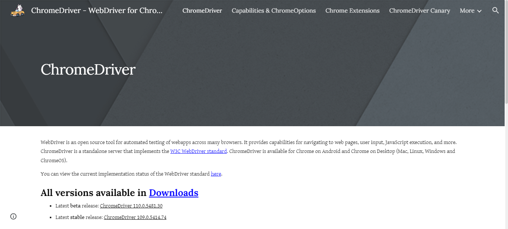

2. Click at the version to download. In some cases you'll need to click on *Download* to find older versions.</br>
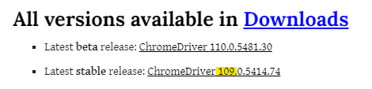

3. Once the chromedriver is downloaded, unzip it and place it into a folder on the project. This way we can use the driver by using the path: `./chromedriver/chromedriver.exe`</br>
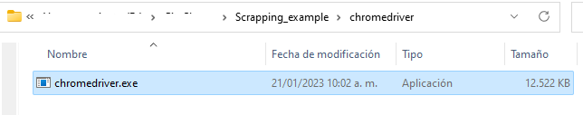

We're ready to go!

## Explore the page
In this example we'll extract all the results of a lotto, so first we'll need to understand how the lotto page is working to navigate it thought the results.

We'll dive into the <a href="https://www.baloto.com/"> **Baloto** </a> page, a colombian lotery, you can access it by clicking <a href="https://www.baloto.com/">here</a>

The page is in spanish so I'll refer to the word in spanish by using *Italic* and the english word by using **bold**.

First, we can notice that the page has a *Results* page (**Resultados**), so let's click on it.


### Looking for a pattern to navigate the results
Now, we can see at first sight the results of the last game. But we want them all.

When we scroll down we can see there's a table summarizing the lotto game status for each instance, but no results. 

We can see that there's a *game number* at the column **N° de sorteo** and for each game number there are two types of *games* at the column **sorteo**: Baloto and Revancha

So, let's check the game number 2261 by clicking *view detail* (**ver detalle**) and see if we can find any pattern to get through all the results.

Here we have the result numbers and taking a look to the URL it seems like a pattern.

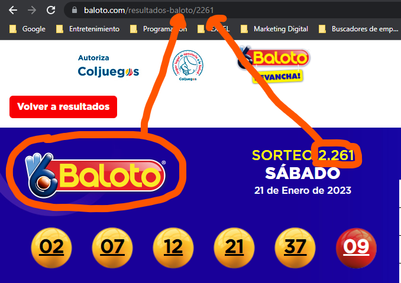

Let's check same game nunmber but different type going backwards and clicking the next row on the table.

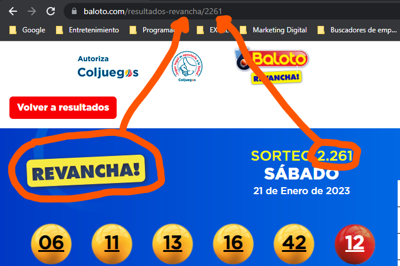

Seems like a pattern, lets try changing the game number to 2259 in the URL.

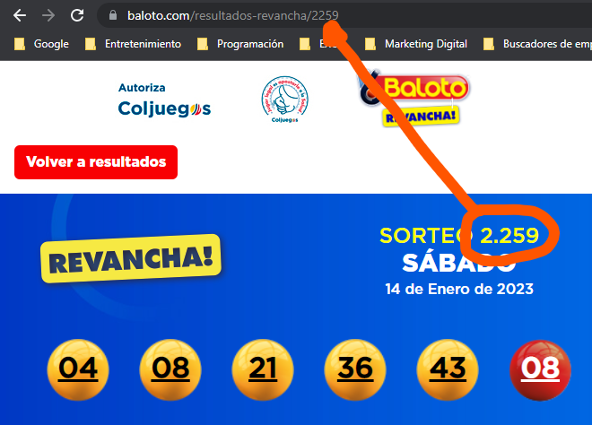

It's a pattern!

Now check yourself the lowest number game to use it to navigate through all the games from it to 2261

### Check the numbers CSS

To get the result numbers we'll need to know where are they placed on the page, we'll use one of the developer's tool called the 'inspector'.

We'll inspect the ball to get its class. So first, right-click the ball to open the context menu, then click *Inspect*.

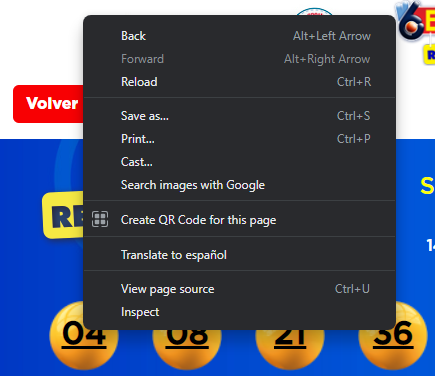</br>
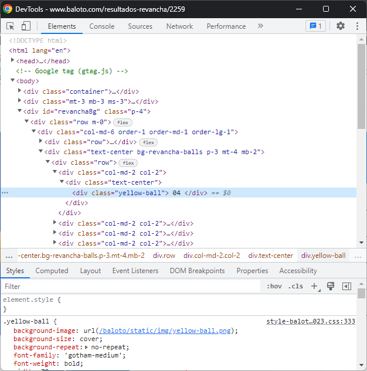

Well done! Now we know the yellow ball belongs to the class `"yellow-ball"` but, will it work with the red ball? Let's check
</br>

We'll use the element selector tool to select the red ball with the developer tool already opened.

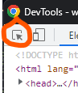

Once we click on the red ball we noticed that the red ball belongs to the class `"red-ball"`
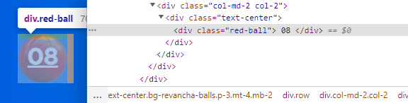

### Sumary

Now we know that the URL has a pattern with two dependencies:

- Game type (baloto|revancha)
- Game number (2261|2259 examples)

Adn that the result balls belong to two classes:

- `yellow-ball`
- `red-ball`

Time to code!

## The code

So, we'll open a Chrome instance to run from 2081 to 2261 for both kind of games.

### Importing the modules we'll use

We'll need the Selenium module to open a Chrome instance, pandas and numpy to save the results collected and time to set a timer while the page is loading.

```Python
from selenium import webdriver
from selenium.webdriver.common.by import By
import time
import numpy as np
import pandas as pd
```

### Settup variables

The next step is to settup the variables. As we already know, there's a part of the URL tha is constant for every game, so we'll store it into a variable.

Also, we'll create a list with the game names

```Python
url = 'https://www.baloto.com/resultados-' #baloto o revancha / num_sorteo
tipos = ['baloto', 'revancha']
```

I also created a list for the titles of the data, and an empty list to store the list of the results. 

```Python
datos = ['tipo', 'sorteo', 'num1', 'num2', 'num3', 'num4', 'num5', 'power', 'fecha']
resultados = []
resultados.append(datos)
```

### Use the cromedriver

Once we initialized the variables we can open a driver to use Chrome through the Python interpreter.

The driver can be instanced by using the open() close() commands, but we'll use the with clause to avoid the close() command.

```Python
with webdriver.Chrome(executable_path="./chromedriver/chromedriver.exe") as driver:
```

The object `driver` will allow us to manipulate Chrome.

#### Navigating the pages

To go from game 2081 to 2261 we need to use a `for` loop, inside it we'll switch between type of games *baloto and revancha*. We already have them stored into a list called `tipos`.

Every time that the URL change we'll need to store a new result, so we created an empty list to store the data.

```Python
    for sorteo in range(2081,2261):
        for tipo in tipos:
            resultado = []
            resultado.append(tipo)
            resultado.append(sorteo)
```

This way we are sure that there'll be a type of game baloto and revancha for every game number.

Let's build the URL with the pattern we already checked.

We have a static portion of the URL stored in the variable `url` then goes the game type iterated at the for clause as `tipo` and at the very end goes the game number iterated at the main for clause as `sorteo`.

So the URL for the code will be like this:
```Python
f'{url}{tipo}/{sorteo}'
```

With this we'll use the driver's method `get(url)` to navigate to each page. It might look like this:
```Python
            driver.get(f'{url}{tipo}/{sorteo}')
```

Now we got something like this:
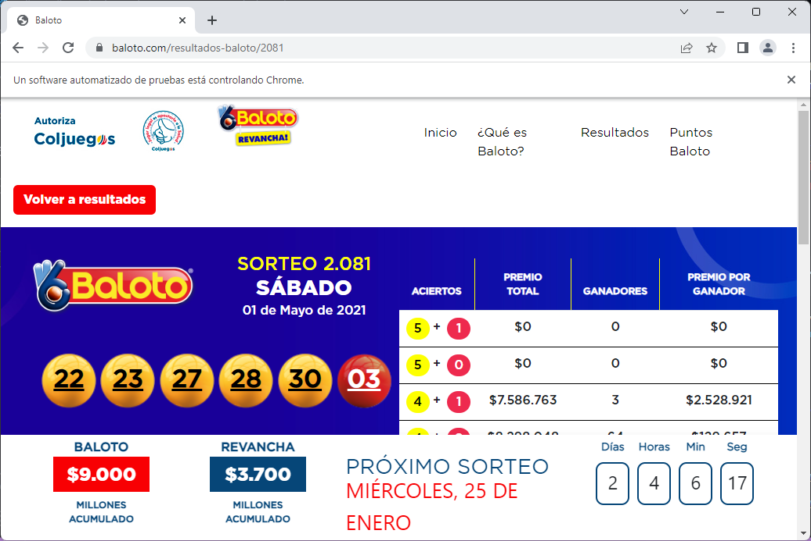

### Getting the numbers

We already know that there are several numbers in the class `yellow-ball` but one at the `red-ball` so we'll create a loop to iterate the `yellow-ball` items and append the text to the result list, then append the `red-ball` value.

```Python
            for balota in driver.find_elements(by=By.CLASS_NAME, value='yellow-ball'):
                resultado.append(balota.text)
            
            power_ball = driver.find_element(by=By.CLASS_NAME, value='red-ball')
            resultado.append(power_ball.text)
```

Here we've used two methods of the driver object:

- `find_elements` allow us to get all the elements that matches with the arguments. It return a list of elements.
- `find_element` give us an only one element that match with the arguments passed. If several elements match the arguments, it will return the first match.

The arguments of both methods are:

- `by` It will set to the driver wich element feature to compare. In this case we used the class name so we gave the `By.CLASS_NAME` value
- `value` set the feature's value to match. In the example we used `'yellow-ball'` for the 5 yellow balls and `'red-ball'` for the only red ball.

### Saving the results

Now we have collected all the data, we´re ready to save it as a CSV file, or the one that you preffer.

I converted the results to a pandas DataFrame and then renamed the columns' name to the ones that we set before.

```Python
df_resultados = pd.DataFrame(np.array(resultados))
df_resultados.columns = np.array(datos)
```

Now just need to use the `to_csv()` method of the DataFrame and we're done!

```Python
df_resultados.to_csv('./Dataset_baloto/resultados_baloto.csv', sep='|', index=False)
```